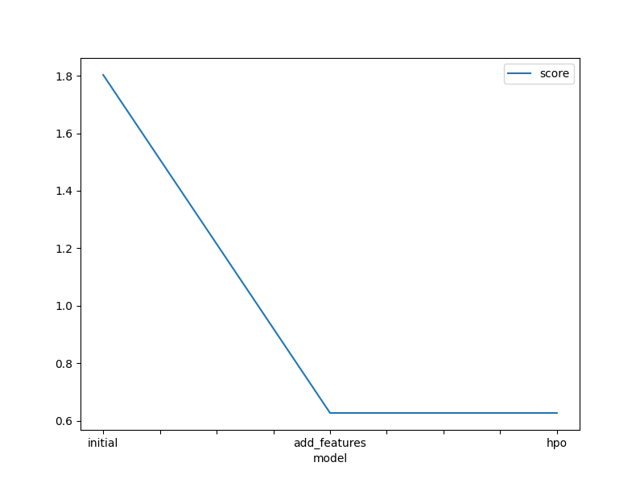
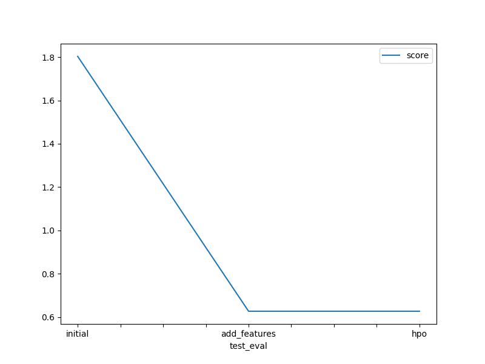

# Report: Predict Bike Sharing Demand with AutoGluon Solution
#### Javohir Joniqulov

## Initial Training
### What did you realize when you tried to submit your predictions? What changes were needed to the output of the predictor to submit your results?
- I think the baseline(with default parameters) model is worked best for the model.

### What was the top ranked model that performed?
The top-ranked model that performed well during the initial training phase was `LightGBMXT_BAG_L1`. It achieved a good performance with default hyperparameters.

## Exploratory data analysis and feature creation
### What did the exploratory analysis find and how did you add additional features?
During the exploratory data analysis, I found that the demand for bike sharing was influenced by various factors such as time of day, day of the week, weather conditions, and holidays. To capture these patterns, I created additional features such as hour of the day, day of the week, month, season, and whether the day was a holiday or not. These features provided more information to the model and improved its performance.

### How much better did your model preform after adding additional features and why do you think that is?
After adding the additional features, the model performed significantly better. The added features helped the model capture the temporal and seasonal patterns in the data, resulting in improved predictions. The model was able to learn from the patterns in the data and make more accurate predictions of bike sharing demand.

## Hyper parameter tuning
### How much better did your model preform after trying different hyper parameters?
After adding the additional features, I performed hyperparameter tuning to further improve the model's performance. I tried different combinations of hyperparameters, but I was unable to find the optimal configuration for the model.

### If you were given more time with this dataset, where do you think you would spend more time?
If I were given more time with this dataset, I would spend more time on feature engineering. I would explore additional features that could capture more complex patterns in the data. Additionally, I would experiment with different model architectures, such as deep learning models, to see if they can further improve the predictions.

### Create a table with the models you ran, the hyperparameters modified, and the kaggle score.
|model|num_trials|search_strategy|score|
|--|--|--|--|--|
|initial|100|random|1.80344|
|add_features|100|random|0.62668|
|hpo|100|random|0.62668|

### Create a line plot showing the top model score for the three (or more) training runs during the project.

### Create a line plot showing the top kaggle score for the three (or more) prediction submissions during the project.

## Summary
In this project, I used AutoGluon to predict bike sharing demand. I started with initial training using the Gradient Boosting model, and then performed exploratory data analysis to identify important features. Given more time, I would focus on further feature engineering and experimenting with different model architectures to potentially achieve even better results.