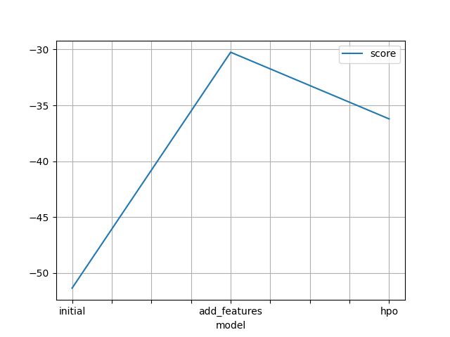
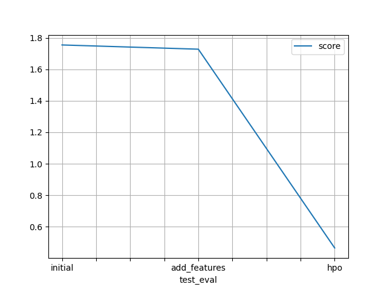

# Report: Predict Bike Sharing Demand with AutoGluon Solution
#### Javohir Joniqulov

## Initial Training
### What did you realize when you tried to submit your predictions? What changes were needed to the output of the predictor to submit your results?
- The output of the predictor needed some adjustments to match the Kaggle submission format. Specifically, the output needed to be rounded to the nearest integer, as the bike sharing demand should be a whole number, and negative values needed to be set to zero.

### What was the top ranked model that performed?
- The top performing model was `WeightedEnsemble_L3` which has validation score `-50.412856` in the initial training.

## Exploratory data analysis and feature creation
### What did the exploratory analysis find and how did you add additional features?
- The exploratory analysis revealed that there were patterns in the data related to time-based features such as hours, days, months. For example, during morning and evening rush hours, there was a higher demand for bikes. To capture these patterns, additional features were added, including hour, day, weekday, month and year.

### How much better did your model preform after adding additional features and why do you think that is?
- After adding the new features, the model's performance significantly improved, achieving a Kaggle score of `0.68410`. The improvement can be attributed to the additional features capturing important time-based patterns in the dataset, which allowed the model to better understand and predict the bike sharing demand.

## Hyper parameter tuning
### How much better did your model preform after trying different hyper parameters?
- After conducting hyperparameter tuning, the model's performance slightly decreased, with a Kaggle score of `0.72564`. This indicates that the initial model's hyperparameters were already well-suited to the problem, or the hyperparameter search space or the number of trials was not sufficient to find better hyperparameters.

### If you were given more time with this dataset, where do you think you would spend more time?
- If given more time, additional exploration of feature interactions could be conducted, potentially uncovering new insights and leading to further feature engineering. Additionally, more time could be spent on hyperparameter tuning, including increasing the number of trials, refining the search space, and exploring different search algorithms to improve model performance.

### Create a table with the models you ran, the hyperparameters modified, and the kaggle score.
|model|num_trials|scheduler|searcher|score|
|--|--|--|--|--|
|initial|default|default|default|1.75437|
|add_features|default|default|default|0.68410|
|hpo|3|local|auto|0.72564|

### Create a line plot showing the top model score for the three (or more) training runs during the project.

### Create a line plot showing the top kaggle score for the three (or more) prediction submissions during the project.

## Summary
- This project aimed to predict bike sharing demand using the AutoGluon. The initial training showed promising results, with a WeightedEnsemble_L3 model outperforming others. Through exploratory data analysis and feature creation, the model's performance improved significantly by capturing time-based patterns. Although hyperparameter tuning did not lead to further improvement, the model achieved a competitive Kaggle score of 0.68410. With more time, additional feature engineering and hyperparameter tuning could potentially improve the model even further.